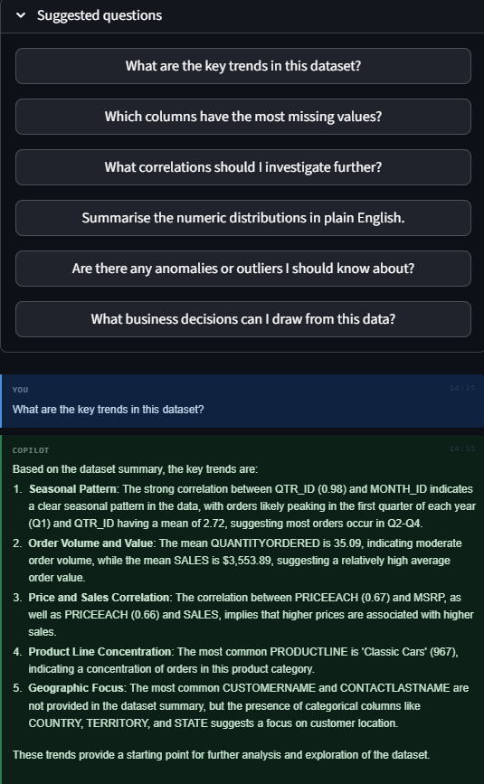

# InsightX
### Modular AI Data Intelligence Platform

<p align="center">
  Automated analytics, data quality evaluation, AI-assisted interpretation, and executive report generation.
</p>

<p align="center">
  
  
  
  
</p>

<p align="center">
  <a href="https://insightx-ai-data-intelligence.onrender.com">
    
  </a>

  <a href="https://github.com/sujanya-hub/InsightX-AI-Data-Intelligence">
    
  </a>
</p>

---

## Live Deployment

| Service | Link |
|---|---|
| Live Demo | https://insightx-ai-data-intelligence.onrender.com |
| GitHub Repository | https://github.com/sujanya-hub/InsightX-AI-Data-Intelligence |

---

## Overview

InsightX is a modular AI-powered analytics platform built to automate the end-to-end data analysis workflow — from dataset ingestion and preprocessing to statistical interpretation and report generation.

The system combines:
- automated data profiling
- preprocessing pipelines
- exploratory analysis
- AI-assisted interpretation
- executive-style reporting

into a single workflow designed for rapid analytical review and decision support.

The project focuses on combining deterministic analytics with LLM-assisted explanations while keeping the analytical pipeline modular and explainable.

---

## Preview

### Data Quality & Profiling Dashboard

Automated profiling, quality scoring, missing value analysis, and dataset health evaluation.


---

### AI-Powered Analytics Copilot

LLM-assisted insight generation using structured statistical context and Groq inference.



---

### Executive Reporting Interface

Automated visual summaries and PDF-ready analytical reporting workflows.


---

## System Workflow

InsightX simulates a real-world analytics pipeline through multiple processing stages:

1. Dataset ingestion and schema validation  
2. Data quality analysis and profiling  
3. Automated preprocessing and cleaning  
4. Exploratory Data Analysis (EDA)  
5. Statistical insight generation  
6. LLM-assisted interpretation  
7. Executive report generation  

The architecture separates analytics, AI reasoning, reporting, and UI layers so components can evolve independently.

---

## Core Modules

### Data Engineering & Quality Assurance

- Automated statistical profiling
- Missing value analysis
- Duplicate detection
- Outlier identification
- Data quality scoring
- Distribution analysis

### Analytics & AI Copilot

- Exploratory Data Analysis (EDA)
- KPI and trend extraction
- Scenario-based analytical reasoning
- Risk and opportunity identification
- LLM-assisted natural language explanations

### Reporting & Visualization

- Automated chart generation
- Business-style analytical summaries
- PDF report generation using ReportLab
- Structured export-ready outputs

---

## Why This Architecture?

Most analytics dashboards stop at visualization and require manual interpretation of statistical outputs.

InsightX extends this pipeline by combining:
- deterministic statistical analysis
- automated preprocessing
- AI-assisted interpretation
- structured reporting

to reduce manual analytical overhead while keeping the workflow explainable and modular.

The system intentionally separates:
- preprocessing logic
- analytics pipelines
- AI interpretation
- reporting generation

so the platform remains maintainable and extensible as additional analytical modules are added.

---

## Engineering Decisions

| Decision | Reasoning |
|---|---|
| Modular pipeline separation | Simplifies debugging and future expansion |
| Deterministic preprocessing | Improves reproducibility of analytical outputs |
| Data quality scoring heuristics | Provides quick dataset health estimation |
| LLM-assisted explanations | Converts statistical outputs into readable insights |
| ReportLab integration | Enables exportable executive-style reporting |
| Streamlit state management | Supports multi-module interaction and caching |

---

## System Architecture

```text
InsightX
│
├── core/
│   ├── ingestion/        # Data loading and validation
│   ├── cleaning/         # Preprocessing pipelines
│   ├── profiling/        # Data quality and statistics
│   ├── analytics/        # EDA and business logic
│   ├── ai/               # LLM integration and prompt handling
│   └── reporting/        # PDF generation
│
├── modules/              # Streamlit UI modules
├── utils/                # Shared utilities
└── app.py                # Application controller
```

---

## Technical Stack

| Layer | Technology |
|---|---|
| Language | Python 3.9+ |
| Framework | Streamlit |
| Data Processing | Pandas, NumPy |
| Analytics | Scikit-learn |
| LLM Integration | Groq API (Llama / Mixtral) |
| Visualization | Matplotlib, Seaborn |
| Reporting | ReportLab |
| Deployment | Render |

---

## Project Structure

```text
InsightX/
│
├── assets/
│   ├── data-quality-dashboard.png
│   ├── ai-copilot.png
│   └── reporting-dashboard.png
│
├── core/
│   ├── ingestion/
│   ├── cleaning/
│   ├── profiling/
│   ├── analytics/
│   ├── ai/
│   └── reporting/
│
├── modules/
├── utils/
├── app.py
├── requirements.txt
└── README.md
```

---

## Performance Notes

| Metric | Observation |
|---|---|
| Processing Flow | End-to-end automated analytics pipeline |
| Report Generation | Automated PDF export support |
| AI Interpretation | Real-time LLM-assisted insight generation |
| Scalability | Modular architecture for future expansion |

Performance depends on:
- dataset size
- preprocessing complexity
- visualization rendering load
- external LLM response latency

---

## Current Limitations

- Large datasets may increase preprocessing and visualization time.
- Outlier detection heuristics may require tuning for domain-specific datasets.
- AI-generated interpretations should still be reviewed for business-critical decisions.
- PDF report generation can become slower for visualization-heavy reports.
- Persistent storage and user session management are not yet implemented.

---

## Installation

### 1. Clone Repository

```bash
git clone https://github.com/sujanya-hub/InsightX-AI-Data-Intelligence.git

cd InsightX-AI-Data-Intelligence
```

---

### 2. Install Dependencies

```bash
pip install -r requirements.txt
```

---

## Environment Configuration

Create:

```bash
.streamlit/secrets.toml
```

Add:

```toml
GROQ_API_KEY = "your_api_key_here"
```

---

## Run Application

```bash
streamlit run app.py
```

---

## Deployment (Render)

### Build Command

```bash
pip install -r requirements.txt
```

### Start Command

```bash
streamlit run app.py --server.port $PORT --server.address 0.0.0.0
```

### Environment Variable

```env
GROQ_API_KEY=your_api_key
```

---

## Example Use Cases

### Business Intelligence Workflows
Generate analytical summaries and KPI-focused reports.

### Data Quality Validation
Evaluate dataset reliability before downstream modeling.

### Academic & Research Analysis
Perform automated profiling and exploratory analysis on research datasets.

### AI-Assisted Reporting
Convert raw statistical outputs into executive-readable insights.

---

## Planned Improvements

- Predictive modeling pipelines
- Forecasting and classification support
- Real-time data ingestion
- Multi-LLM backend routing
- PostgreSQL integration
- Authentication and user sessions
- Scheduled report generation

---

## Developer

### Sujanya Srinivas

Data Science & AI Developer focused on:
- Applied Analytics Systems
- AI-Assisted Data Interpretation
- Automated Reporting Pipelines
- Data Quality Engineering
- Full-Stack AI Applications

---

## License

MIT License
